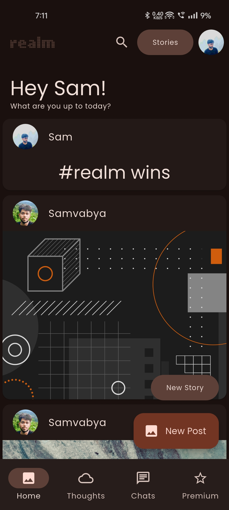
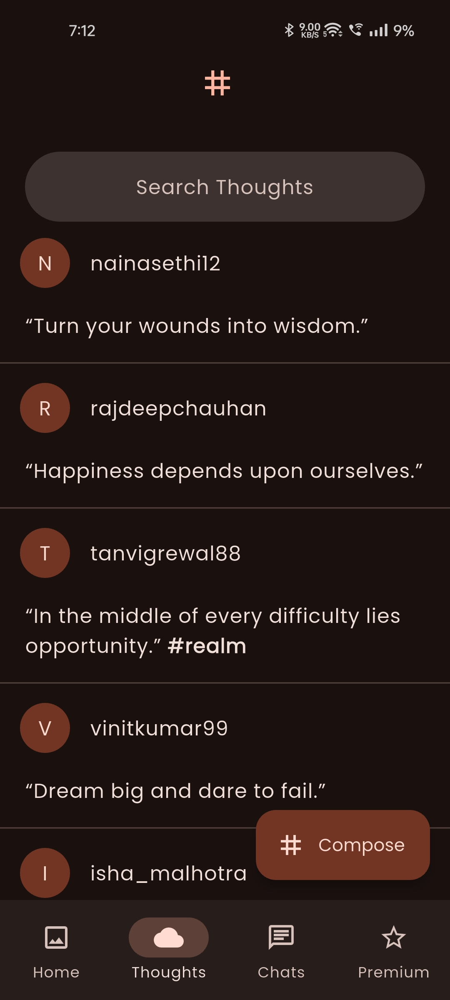
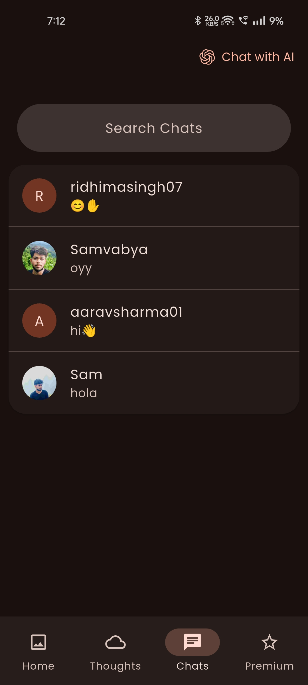
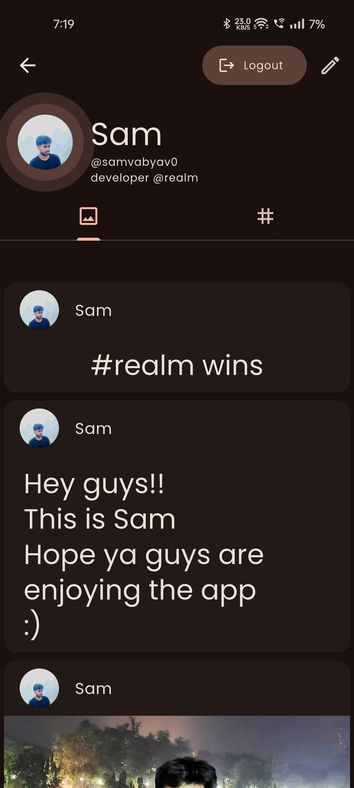
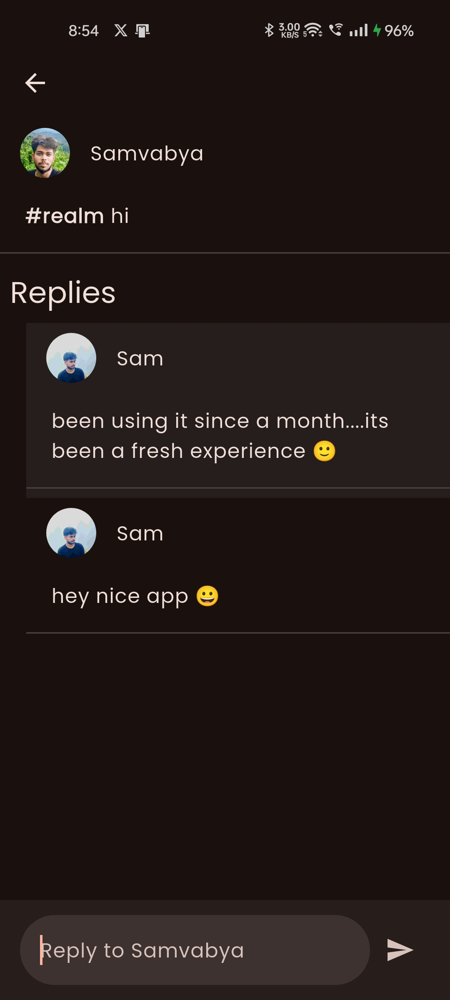
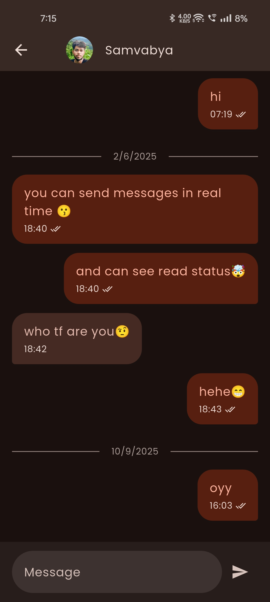
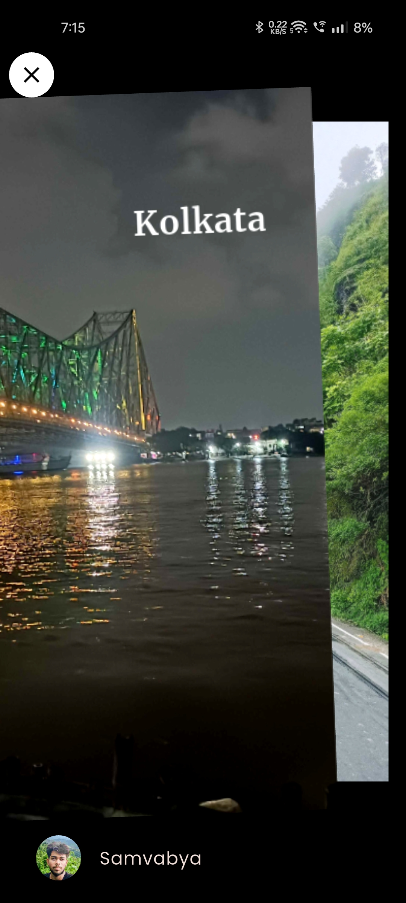
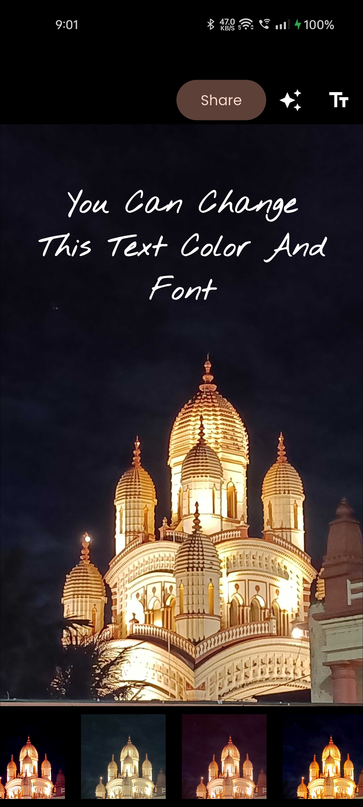

    
    <h1>realm</h1>
    
An Alrounder Social Media App built in Flutter.

---

  

  

  

## Features

### Posts

- share photo posts hassle free
- use filter to enhance your pics
- like and comment (soon)

### Stories

- post single persistent story
- edit photos with filters
- add text with various fonts and styles and colors
- view each other stories on profile with crazy glow animation
- your stories don't disappear 

### Thoughts (new)

- share your thoughts on a topic by using hashtags
- guys with similar interest can follow or join you on the topic
- discuss the topic in brief in the thought comment section
- comment on each other's thoughts
- share your opinion and know other's

### Misc

- minimal subtle UI for relaxed experience
- caos free feed
- search people and view their profile
- material 3 design inspired from Google apps
- adaptive dynamic colour theme adapts to wallpaper
- sign in with google (to be fixed)
- cross platform accessibility for web (soon)

## Installation

## Tech Stack

**Client:** Flutter, Android

**Backend:** Supabase, Openrouter
