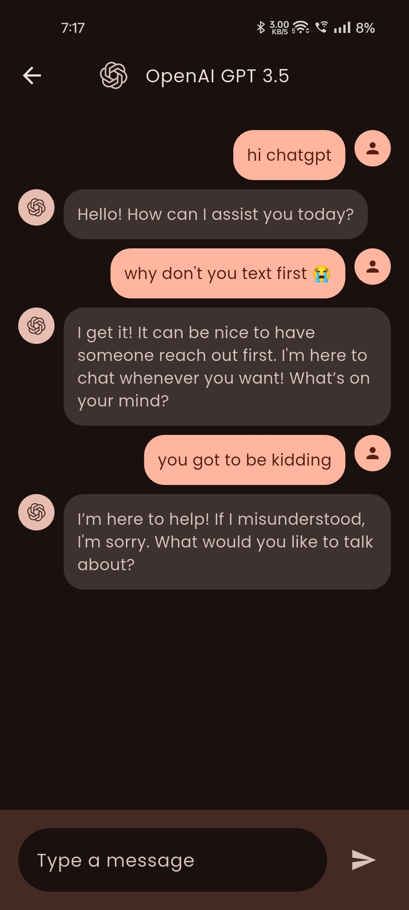

    
    <h1>realm</h1>
    
An Alrounder Social Media App built in Flutter.

---

  

  

  

## Features

- Share photos on the go
- Share and comment on thoughts(NEW)
- Create wonderful stories
- Chat with one another
- Chat with GPT AI(NEW)
- Premium Material 3 UI
- Responsive Dark and Light mode

## Coming Soon

- Like, Comment on photos and thoughts
- Cross-platform web app
- Wallpaper matching dynamic theme

## Installation

## Tech Stack

**Client:** Flutter, Android

**Backend:** Supabase, Openrouter
